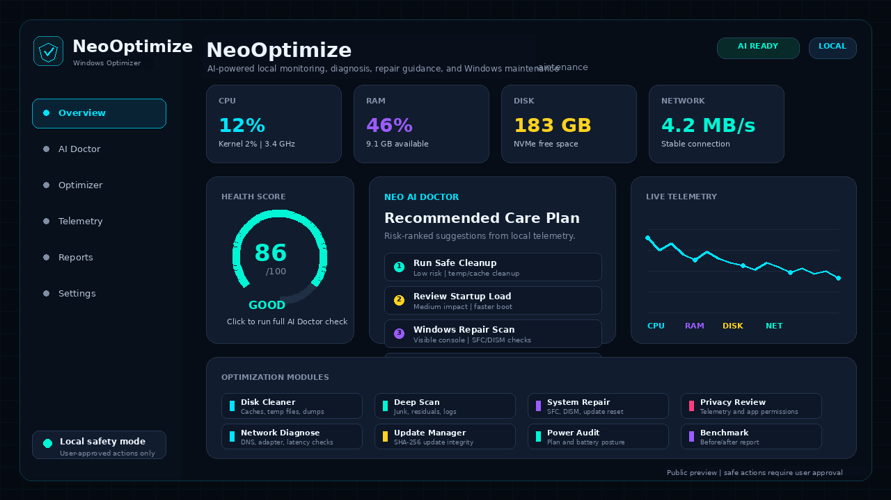

# NeoOptimize

AI-powered Windows optimization and maintenance platform.

NeoOptimize is a local Windows utility for inspecting system health, finding
performance problems, cleaning safe junk files, auditing security posture,
repairing common Windows issues, and producing before/after maintenance reports.
Public releases focus on NeoOptimize only.



## Download

| Item | Value |
| --- | --- |
| Version | `1.0.0` |
| Installer | `NeoOptimize.exe` |
| SHA-256 | `d4bd14067e0ebbe584688aa6b3233c74f19e9d944d81788e560995598a094d32` |
| Portable ZIP | `NeoOptimize-portable.zip` |
| Portable SHA-256 | `d1e9449ec701822840c9c736567ae7ae044afe0ba075594c369a56e8a8682846` |
| Release | https://github.com/NeoOptimize/NeoOptimize/releases/tag/v1.0.0 |

Verify the installer before running it:

```powershell
Get-FileHash .\NeoOptimize.exe -Algorithm SHA256
```

The hash must match:

```text
d4bd14067e0ebbe584688aa6b3233c74f19e9d944d81788e560995598a094d32
```

## Package Managers

Package manager manifests are prepared under `distribution/`:

| Channel | Package | Status |
| --- | --- | --- |
| WinGet | `ZenthralixLab.NeoOptimize` | Manifest prepared for registry submission. |
| Chocolatey | `neooptimize` | Package template prepared for moderation submission. |
| Scoop | `neooptimize` | Portable manifest prepared for bucket submission. |

The official registry submissions are staged. Until each registry accepts the
package, use the GitHub Release download and verify the SHA-256 checksum.

## Code signing policy

Free code signing provided by SignPath.io, certificate by SignPath Foundation.
NeoOptimize is preparing a SignPath-based signing workflow for public freeware
releases. See `SIGNPATH.md`.

The workflow is intentionally gated until the public repository contains the
client source and installer build recipe required to build the installer inside
GitHub Actions.

Team roles:

- Committers and reviewers: NeoOptimize maintainers.
- Approvers: Zenthralix-Lab release owners.

Privacy policy:

This program will not transfer information to other networked systems unless
specifically requested by the user or the person installing or operating it.

## What NeoOptimize Does

NeoOptimize is designed for practical Windows maintenance, not cosmetic
"one-click magic." It combines local telemetry, guided repair flows, and AI
assisted recommendations so users can understand what is wrong before applying
changes.

Core goals:

- Diagnose slow, unstable, or cluttered Windows systems.
- Explain likely causes in plain language.
- Recommend safe maintenance steps by risk level.
- Run visible, user-approved repair and cleanup tasks.
- Measure the result with before/after benchmark data.
- Keep high-risk actions gated behind confirmation.

## Main Features

### System Overview

- Health score summary for quick system status review.
- CPU, GPU, RAM, disk, and network monitoring.
- Device profile including OS, runtime, storage, and basic hardware data.
- Process, thread, handle, uptime, and power-state visibility.
- Fast snapshot report for support or personal troubleshooting.

### Mini Tray

- Lightweight tray companion in the lower-right Windows notification area.
- 1-second CPU, RAM, and disk status tooltip.
- Compact realtime monitor window for quick desktop checks.
- NEO chat shortcut for local AI guidance.
- Voice command shortcut using push-to-talk behavior.
- Update Manager, reports, and provider status shortcuts.

### AI Doctor

- Health check workflow for common Windows performance problems.
- Risk-ranked care plan with recommended next steps.
- Anomaly review for unusual CPU, memory, disk, network, or process behavior.
- Explanation-first output so the user can see why a task is recommended.
- Maintenance report generation after scans and repairs.

### NEO Agentic Autopilot

- Local observe, diagnose, plan, approve, act, verify, and learn loop.
- Runs through allowlisted NeoOptimize modules instead of arbitrary hidden commands.
- Requires user confirmation before executing maintenance actions.
- Writes local agentic reports and outcome memory for later review.
- Can be launched from the main UI, CLI, or mini tray.

### Optimizer Modules

- Safe Cleanup: removes temporary files, caches, logs, and common residual files.
- Deep Junk Scan: searches deeper junk locations before deletion.
- Startup Review: helps identify apps that slow down boot.
- Service Review: audits services that may affect performance or stability.
- Disk Diagnostics: checks free space, disk health indicators, and queue pressure.
- Network Diagnostics: reviews DNS, adapter state, latency, and connectivity.
- Power Audit: checks current power plan and performance-related settings.
- Privacy Review: audits common telemetry and app permission settings.
- Update Audit: reviews Windows Update state and repair options.
- System Repair: guided SFC, DISM, WinRE, boot, and update reset workflows.
- Benchmark: records before/after metrics for evidence-based maintenance.
- Report Export: saves local reports for review.

### Security And Recovery

- Security audit for Defender, firewall, ASR, Controlled Folder Access, SMB, TLS,
  UAC, and exploit posture.
- Defender Lab Recovery mode for machines that were hardened too aggressively
  during testing.
- High-risk actions require user confirmation.
- Repair flows run visibly instead of silently changing the system.
- Public builds do not disable Defender realtime protection silently.

### Update Manager

- Update check and repair workflow.
- Credential-gated update action.
- SHA-256 integrity verification before applying packages.
- Recovery path for incomplete or damaged installs.
- Linux Mint style Update Manager flow: check first, review metadata, then
  install verified updates or repair NeoOptimize.

### Remote Access Readiness

- Optional readiness check for managed Windows maintenance environments.
- Disabled by default and dry-run first.
- Requires Administrator approval and explicit apply mode before changing WinRM,
  OpenSSH, or local firewall settings.
- Uses scoped firewall rules and blocks broad wildcard targets.
- Does not bundle third-party guest tools in the public installer.

### Secure Transport Guard

- Request signing support for trusted maintenance channels.
- Optional HTTPS enforcement and certificate pinning.
- Private lab HTTP is limited to local/private networks when enabled.
- Replay protection support for signed requests.
- Input validation for telemetry, report, and check-in payloads.

## AI Capabilities

NeoOptimize includes a local-first AI workflow named **NEO**:

If asked who it is, NEO answers:

> Saya adalah NEO (Neural Execution Operator), artificial intelligence yang dibangun di zenthralix-lab oleh nol_eight.

### AI Doctor

AI Doctor reads local health signals and turns them into a practical diagnosis.
It looks at resource pressure, disk behavior, update state, startup load,
security posture, and maintenance history to produce a care plan.

### Care Plan Engine

The care plan ranks suggested actions by:

- expected benefit,
- safety risk,
- required privilege,
- reversibility,
- whether the action should be audit-only, cleanup, repair, or benchmark.

### Anomaly Interpreter

The interpreter helps explain symptoms such as:

- high idle CPU,
- RAM pressure,
- disk queue spikes,
- slow boot,
- network instability,
- update failures,
- repeated repair failures,
- unusual process growth.

### Script Planning Assistant

NEO can draft PowerShell or CMD maintenance plans for review. Public builds
keep this as an assisted planning workflow: commands should be reviewed and
approved before execution.

### Benchmark Analyst

The benchmark analyst compares pre-maintenance and post-maintenance metrics to
show whether a cleanup or repair actually helped.

### Local Model Support

NeoOptimize is designed for local AI workflows. Local model support can be used
for offline recommendations and privacy-preserving analysis when configured by
the user.

### Optional Tooling Skills

NEO can recommend optional helper tooling only with user consent:

- Microsoft PowerToys via WinGet for technician productivity workflows.
- Winbindex reference intelligence for Windows binary version/hash investigation.

These are not required dependencies and are not installed silently.

### Role Ownership

NEO separates AI responsibilities so the system stays auditable:

- NEO: local orchestrator, chat, voice, telemetry summary, and safe action planning.
- NEO Agentic Autopilot: local observe-plan-approve-act-verify-learn runtime.
- AI Doctor: Windows health scoring, anomaly detection, and treatment ranking.
- Local Model / Ollama: offline reasoning, diagnostics explanation, and script drafting.
- Script Forge: PowerShell and CMD audit script generation with SHA-256 metadata.
- MCP Bridge: local inventory of skills, connectors, tools, and runtime readiness.
- Update Manager: credential-gated update checks, verified install, and repair flow.

### Operator Skills

NEO is built around practical Windows maintenance skills:

- system health triage,
- cleanup planning,
- repair planning,
- update troubleshooting,
- security posture explanation,
- anomaly interpretation,
- before/after benchmark review,
- PowerShell and CMD maintenance draft generation.

## Safety Model

NeoOptimize is audit-first by default:

- It shows what it is about to do.
- It separates scan, report, cleanup, and repair actions.
- It requires administrator approval for privileged maintenance.
- It avoids hidden drivers, covert capture, and silent destructive repair.
- It keeps reports local unless the user chooses to share them.
- It does not collect camera, microphone, biometric data, browser secrets,
  private keys, or documents by default.
- It keeps remote access bootstrap disabled unless an administrator explicitly
  enables it for a trusted environment.

## Install

1. Open the release page.
2. Download `NeoOptimize.exe`.
3. Verify the SHA-256 checksum.
4. Run the installer as Administrator.
5. Open NeoOptimize from the Start Menu or desktop shortcut.
6. Start with **AI Doctor** or **Safe Care Plan**.

## Windows Defender Notice

Unsigned public installers can trigger SmartScreen or reputation warnings.
Signed releases will use the SignPath Foundation path once the project is
approved. SmartScreen reputation can still take time to build even after signing.

If an older lab build made Windows Security too strict, open NeoOptimize and run
the Defender Lab Recovery action, or run:

```powershell
powershell -NoProfile -ExecutionPolicy RemoteSigned -File .\NeoOptimize.ps1 -Action DefenderAuditMode
```

This keeps Microsoft Defender enabled and moves aggressive lab ASR/CFA/Network
Protection policies to AuditMode.

## System Requirements

| Requirement | Minimum |
| --- | --- |
| OS | Windows 10/11 |
| Privilege | Administrator approval for maintenance actions |
| Runtime | PowerShell 5.1+ |
| Disk | 300 MB free |
| Network | Optional, only for update/download features |

## Release Notes

- Some advanced AI workflows may require additional local model configuration.
- SmartScreen reputation may still be low until the project uses a trusted
  production code-signing certificate.
- Users should create a restore point before running high-impact repair tasks.
- Remote access readiness features are for trusted maintenance environments and
  stay disabled unless explicitly enabled by the administrator.
- The launcher no longer depends on Windows Script Host; it starts through
  PowerShell so systems with Windows Script Host disabled can still open
  NeoOptimize.
- The installer now includes the mini tray, NEO role registry, MCP bridge,
  skills, optional tooling registry, NEO Agentic Autopilot, local model policy,
  and Update Manager repair workflow.

## Support

- Email: neooptimizeofficial@gmail.com
- Buy Me a Coffee support: https://buymeacoffee.com/nol.eight
- Saweria: https://saweria.co/dtechtive
- Dana: https://ik.imagekit.io/dtechtive/Dana

## About

Made with love at Zenthralix-Lab 

## License

NeoOptimize is released under the Apache License 2.0.
