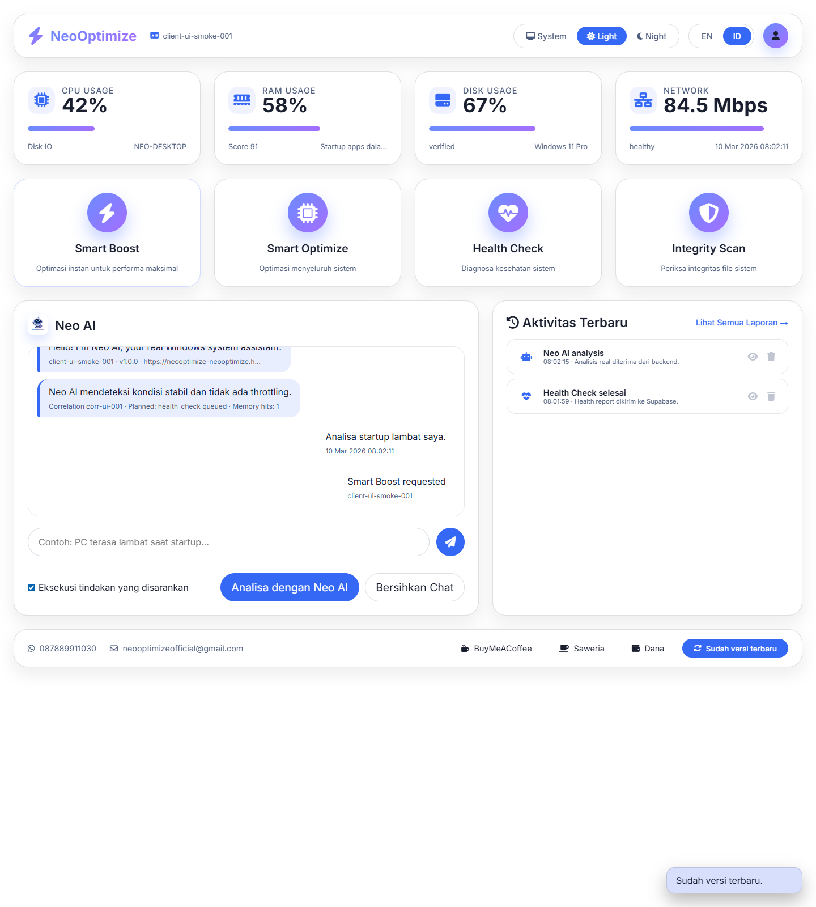

# Neo Optimize AI - Advanced Windows System Optimizer

[](https://github.com/NeoOptimize/NeoOptimize)
[](https://github.com/NeoOptimize/NeoOptimize)
[](https://github.com/NeoOptimize/NeoOptimize/issues)
[](#-license)
[](https://www.python.org)
[](#-features)

> Professional-grade AI-powered Windows optimization system | System cleaning, disk optimization, privacy protection, and autonomous monitoring with explicit consent.

[Documentation](./docs/project-structure.md) • [Issues](https://github.com/NeoOptimize/NeoOptimize/issues) • [Discussions](https://github.com/NeoOptimize/NeoOptimize/discussions)

---

## Features

### Smart Cleaners
- Temporary Files (Implemented)
- Browser Cache (Planned)
- Recycle Bin (Planned)
- Registry Cleanup (Planned)
- Prefetch Files (Planned)

### Disk Optimization
- HDD Defragmentation (Planned)
- SSD TRIM (Planned)
- Disk Scanning and Repair (Planned)
- Free Space Wipe (Planned)

### System Health
- SFC Status Check (Implemented)
- DISM Status Check (Implemented)
- Driver Updates (Planned)
- System Restore Point (Planned)

### Privacy and Security
- Remove Bloatware (Implemented, optional)
- Disable Telemetry (Planned)
- Privacy Cleanup (Planned)

### AI-Powered Features
- Smart Boost (Implemented)
- Smart Optimize (Implemented)
- AI Chat Assistant (Implemented)
- 24/7 Monitoring (Implemented)
- Hugging Face Integration (Implemented)

### Professional Interface
- Web Dashboard (Implemented)
- REST API (Implemented)
- Swagger UI (Implemented at `/docs`)
- Dry-run Preview (Planned)

---

## Quick Start

### Prerequisites
- Windows 10/11/12
- Python 3.10+ (backend development)
- Administrator privileges for maintenance actions

### Installation
```bash
# Clone repository
git clone https://github.com/NeoOptimize/NeoOptimize.git
cd NeoOptimize/backend

# Run auto-setup
start_backend.bat

# In new terminal
start_ui.bat

# Open http://localhost:7861
```

---

## Features at a Glance

| Category | Status |
|----------|--------|
| Cleaners | Implemented (core) + planned extensions |
| Disk Optimization | Planned |
| System Health | Implemented (SFC/DISM status) |
| Privacy and Security | Implemented (bloatware optional) + planned |
| Monitoring | Implemented |
| AI Features | Implemented (chat, Smart Boost/Optimize) |
| REST API | Implemented |
| Web Interface | Implemented |

---

## Documentation

- [Project Structure](./docs/project-structure.md)
- [Backend Quickstart](./backend/QUICKSTART.md)
- [Backend Integration](./backend/INTEGRATION.md)
- [Tutorials](./TUTORIALS.md)
- [Release Guide](./FINAL_RELEASE_GUIDE.md)

---

## Voice Commands and Actions

Example phrases:

- "smart boost", "boost performance", "tingkatkan performa"
- "smart optimize", "optimasi sistem"
- "health check", "periksa kesehatan sistem"
- "integrity scan", "periksa integritas file"
- "clean temp files", "hapus temp"
- "flush dns", "bersihkan dns"
- "clean dump files", "bersihkan memory dump"
- "switch to auto mode", "mode otomatis"
- "switch to manual mode", "mode manual"
- "open reports", "buka laporan"
- "clear chat", "hapus chat"

If a phrase does not match, Neo AI will fall back to chat assistance.

---

## REST API

```bash
# System info (example)
curl -H "X-API-Key: <your_api_key>" http://localhost:7860/system-info

# Smart advice (example)
curl -H "X-API-Key: <your_api_key>" http://localhost:7860/smart-advice

# Execute action (example)
curl -X POST -H "X-API-Key: <your_api_key>" \
  -H "Content-Type: application/json" \
  -d '{"tool_name":"smart_boost","dry_run":true}' \
  http://localhost:7860/execute-tool
```

Interactive API Docs: http://localhost:7860/docs

---

## Integration Examples

### JavaScript (WebView2)
```javascript
const neoAI = new NeoAIClient('http://localhost:7860', 'api_key');
const result = await neoAI.executeTool('smart_boost', {}, true);
console.log(result);
```

### C# (.NET WPF)
```csharp
var service = new NeoAIBackendService();
var info = await service.GetSystemInfoAsync();
var result = await service.SmartBoostAsync(dryRun: true);
```

---

## Safety Features

- Explicit consent gating before execution
- Full logging and audit trail
- Safe error handling and rollback strategy
- Requires admin for maintenance actions

---

## Trial and Licensing

Market test phase uses a 90-day trial that starts on first launch. After the trial ends, AI features are locked while non-AI optimization tools remain available. Subscription activation will be added after the trial period.

---

## Screenshot



---

## Support Development

- Email: neooptimizeofficial@gmail.com
- Buy Me A Coffee: https://buymeacoffee.com/nol.eight
- Saweria: https://saweria.co/dtechtive
- Dana: https://ik.imagekit.io/dtechtive/Dana
- Bitcoin: bc1q3yfdzz5qtllm3luws5zudnz3t6d472r4w05ds5

---

## System Requirements

### Minimum
- OS: Windows 10 Version 1809+
- RAM: 4 GB
- Disk: 500 MB free

### Recommended
- OS: Windows 11/12
- RAM: 8 GB+

---

## License

NeoOptimize Software License Agreement. See [LICENSE.txt](./LICENSE.txt).

---

## Contributing

We welcome contributions. See [CONTRIBUTING.md](./CONTRIBUTING.md).

---

## Acknowledgments

- FastAPI
- Supabase
- Hugging Face
- WebView2
- Anime.js
- Lottie
