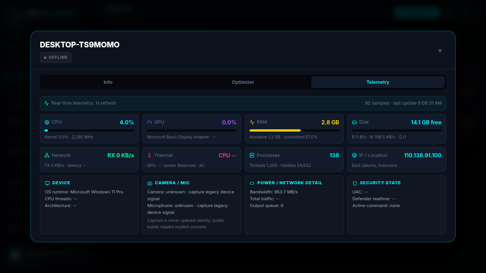

# NeoOptimize

NeoOptimize is an AI-powered Windows optimization and maintenance platform built for local-first endpoint care and secure fleet operations.

It combines a Windows client, a self-healing .NET agent, a web RMM console, real-time telemetry, signed command dispatch, rollback safety, and optional AI/cloud integrations.



## Highlights

- Windows optimization and maintenance modules for cleanup, performance, services, updates, privacy, network, backup, diagnostics, integrity checks, and repair workflows.
- Real-time endpoint monitoring for CPU, GPU, RAM, disk, network, thermal state, process counts, IP/location, device profile, and security state.
- Neo AI advisory layer for diagnosis, recommendations, script planning, local model guidance, and RMM/OpenFang context delivery.
- Safety-first execution with RSA signed commands, local self-healing runtime, registry snapshots, guardrails, rollback reports, and release readiness checks.
- Open-core architecture with a community client and optional team features for RMM, telemetry, command queue, update delivery, Supabase mirror, E2B sandbox, Hugging Face Spaces, and local Ollama.
- Public installer hygiene: no bundled VM guest tools, no private keys, no local credentials, no lab-only certificates in the public source tree.

## Current Release

| Item | Value |
| --- | --- |
| Suite | NeoOptimize v1.2.0 NeoCortex |
| Channel | public-beta |
| Windows installer | `NeoOptimize.exe` |
| Installer SHA-256 | `cdb34d5c490b2fbd0ce042d8a12509794e43fd5e0847b22b663c5ca83bef5d4a` |
| Client runtime | PowerShell 5.1+ and .NET 8 agent |
| RMM runtime | Node.js 20+, Fastify, PostgreSQL, Redis |
| Dashboard | React, Vite, Recharts |

Download installers from the GitHub Releases page. Verify the SHA-256 checksum before running the installer.

## Components

| Component | Purpose |
| --- | --- |
| `client/` | Windows GUI, local optimizer modules, Neo AI client features, update manager, voice command entry points. |
| `agent/` | .NET 8 Windows service for telemetry, signed command execution, safety runtime, rollback, and endpoint reporting. |
| `server/` | RMM API, auth, command queue, safety manifests, telemetry ingestion, release readiness, integration bridge. |
| `dashboard/` | RMM web console for systems, alerts, AI analysis, optimizer tasks, audit logs, users, and settings. |
| `installer/client/` | NSIS one-click Windows installer builder. |
| `docs/` | Product model, code-signing notes, architecture notes, and public media. |

## RMM Workflow

1. The Windows agent registers with the RMM server using an enrollment token.
2. The agent streams lightweight telemetry at a configurable interval.
3. The dashboard shows endpoint health, performance, command state, and safety state.
4. RMM commands are signed before delivery.
5. The endpoint verifies the signature, prepares safety state, executes only allowed work, monitors guardrails, and reports success or rollback.
6. Neo AI and OpenFang consume telemetry context for operator review and recommendations.

## Telemetry Model

NeoOptimize telemetry is designed for system maintenance, not personal data collection.

Collected examples:

- CPU utilization, kernel time, clock speed.
- GPU utilization, GPU name, temperature when available.
- RAM usage, available memory, committed memory pressure.
- Disk free space, read/write throughput, queue length, latency.
- Network throughput, bandwidth, output queue, latency, public IP when enabled.
- Device profile, OS/runtime info, process/thread/handle counts.
- Camera/microphone availability status only by default.

Not collected by default:

- camera stream,
- microphone stream,
- documents,
- credentials,
- private keys,
- browser secrets,
- biometric samples.

Camera or microphone diagnostics must remain explicitly consent-gated in public builds.

## Security

- JWT authenticated dashboard sessions.
- Rate-limited login and API paths.
- Parameterized database queries.
- RSA command signing.
- Agent-side signature verification.
- Safety manifest support.
- Registry snapshot and rollback runtime.
- Secure update manager with SHA-256 verification.
- Supabase service credentials remain server-side only.
- Private signing keys must be stored outside the public repository and restricted to `0600` on production Linux hosts.

## Installation

### Windows Client

1. Download `NeoOptimize.exe` from GitHub Releases.
2. Verify the SHA-256 checksum.
3. Run the installer as Administrator.
4. Launch NeoOptimize from the Start Menu.
5. Configure RMM server URL only if fleet management is required.

### RMM Server

```bash
cd server
npm install
cp .env.example .env
npm run keygen
npm start
```

Required production services:

- PostgreSQL
- Redis
- Node.js 20+

Recommended production settings:

- strong `JWT_SECRET`
- strong `AGENT_ENROLLMENT_TOKEN`
- private key storage outside the repository
- HTTPS reverse proxy
- regular database backups

### Dashboard

```bash
cd dashboard
npm install
npm run build
```

The RMM server serves the built dashboard from `dashboard/dist`.

## Build Installer

```bash
./installer/client/build.sh
sha256sum release/NeoOptimize.exe
```

The public installer must be signed with an OV or EV code-signing certificate before broad distribution. A lab certificate is useful for internal validation but does not guarantee SmartScreen trust.

## Integrations

| Integration | Status | Role |
| --- | --- | --- |
| Ollama/local model | Optional | Local advisory analysis and offline-first AI guidance. |
| Hugging Face Spaces | Optional | Hosted model endpoint and model registry path. |
| Supabase | Optional | Cloud mirror, audit log sync, and multi-tenant data extension. |
| E2B | Optional | Sandboxed script validation before risky release. |
| OpenFang | Optional | Security operator context, audit review, and response workflow. |
| NullClaw | Planned operator bridge | Low-level system/security analysis path, not enabled as a hidden driver in public builds. |

## Verification

Recent public-readiness validation:

- Dashboard build passed.
- Agent .NET build passed.
- NeoOptimize client self-test passed.
- Installer bundle self-test passed.
- RMM API audit passed.
- Release readiness passed: 14 checks, 0 warnings, 0 failures.

## Support

- Email: neooptimizeofficial@gmail.com
- Buy Me a Coffee: https://buymeacoffee.com/nol.eight
- Saweria: https://saweria.co/dtechtive
- Dana: https://ik.imagekit.io/dtechtive/Dana

## About

Made with love at Zenthralix-Lab with Codex.

## License

NeoOptimize is released under the Apache License 2.0. Public community builds are intended to stay accessible, while hosted RMM and cloud-backed features can fund ongoing server, maintenance, internet, model, domain, and distribution costs.
