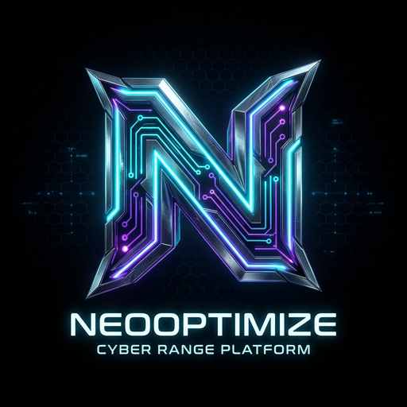

# NeoOptimize

AI-powered Windows optimization and maintenance client.

NeoOptimize helps inspect, clean, diagnose, repair, and maintain Windows systems with a safety-first workflow. Public releases focus on the local Windows application only.



## Download

| Item | Value |
| --- | --- |
| Version | `1.2.1-public-beta` |
| Installer | `NeoOptimize.exe` |
| SHA-256 | `ee34b6733c7fb6958b84281937b18800bafb50fc0d903e7bb1d8ef6e2b5f0508` |
| Release | https://github.com/NeoOptimize/NeoOptimize/releases/tag/v1.2.1-public-beta |

Verify the checksum before running the installer.

```powershell
Get-FileHash .\NeoOptimize.exe -Algorithm SHA256
```

## Features

- Professional Windows maintenance UI.
- Real-time local monitoring for CPU, GPU, RAM, disk, network, process count, uptime, and device profile.
- AI Doctor for health checks, anomaly review, maintenance suggestions, and safe script planning.
- Safe Care Plan for audit, deep scan, diagnostics, light cleanup, and reports.
- Disk cleaner, deep junk scan, Windows diagnostics, disk status, update audit, power audit, and profile checks.
- Security audit mode for Defender, firewall, ASR, Controlled Folder Access, SMB, TLS, UAC, and exploit posture.
- Defender Lab Recovery for restoring aggressive lab ASR/CFA/Network Protection settings to AuditMode without disabling Defender.
- Secure Update Manager with credential gate, SHA-256 integrity verification, and repair flow.
- Optional local AI provider support through NeoCore/Ollama style local workflows.

## Safety

NeoOptimize is audit-first by default.

- High-risk repair actions require confirmation.
- Defender realtime protection is not silently disabled.
- Public builds do not silently apply aggressive Defender hardening.
- Risky Windows repair flows run in a visible console.
- Reports are saved locally for review.
- Camera, microphone, biometric data, browser secrets, private keys, and documents are not collected by default.

## Install

1. Download `NeoOptimize.exe` from the release page.
2. Verify the SHA-256 checksum.
3. Run the installer as Administrator.
4. Open NeoOptimize from the Start Menu or desktop shortcut.
5. Start with **Safe Care Plan** or **AI Doctor Health**.

## Windows Defender Notice

Unsigned public beta installers can trigger SmartScreen or reputation warnings. Broad public distribution requires a trusted OV/EV code-signing certificate and download reputation over time.

If an older lab build made Windows Security too strict, open NeoOptimize and run:

```powershell
powershell -NoProfile -ExecutionPolicy RemoteSigned -File .\NeoOptimize.ps1 -Action DefenderAuditMode
```

This keeps Microsoft Defender enabled and moves aggressive lab ASR/CFA/Network Protection policies to AuditMode.

## System Requirements

| Requirement | Minimum |
| --- | --- |
| OS | Windows 10/11 |
| Privilege | Administrator approval for maintenance actions |
| Runtime | PowerShell 5.1+ |
| Disk | 300 MB free |
| Network | Optional, only for update/download features |

## Support

- Email: neooptimizeofficial@gmail.com
- Buy Me a Coffee: https://buymeacoffee.com/nol.eight
- Saweria: https://saweria.co/dtechtive
- Dana: https://ik.imagekit.io/dtechtive/Dana

## About

Made with love at Zenthralix-Lab with Codex.

## License

NeoOptimize is released under the Apache License 2.0.
